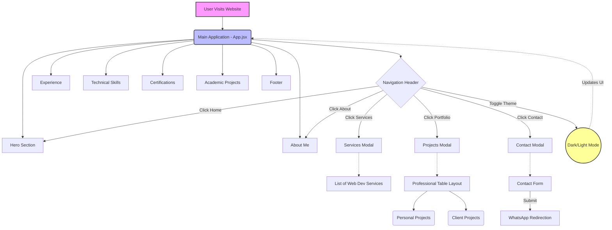

# ManishCV - Dynamic Personal Portfolio

Welcome to **ManishCV**, my dynamic personal portfolio website built to showcase my journey, skills, and the projects I've worked on. This project represents a comprehensive overview of my professional growth, from learning the basics of web development to completing internships and developing complex full-stack applications.

## 🌟 Project Journey

My journey with this portfolio website has been continuous evolution:

1.  **The Beginning:** It started as a way to practice the foundational technologies I learned during my early internships—HTML, CSS, and basic JavaScript.
2.  **Adding Interactivity:** As I upskilled into React.js and modern frontend frameworks, I rebuilt the portfolio to be a Single Page Application (SPA), making it faster and more dynamic.
3.  **Showcasing Real Work:** With every new internship (like Unified Mentor, EduNet Foundation, and EduSkills Academy) and client project (from static informational sites to full-stack e-commerce platforms), I expanded the "Experience" and "Projects" sections.
4.  **UI/UX Refinements:** I constantly iterated on the design, adding features like a Dark Mode toggle, smooth scrolling, interactive modals for viewing projects, and professional table layouts for data presentation.
5.  **The Result:** Today, this portfolio stands as a testament to my dedication to clean code, responsive design, and continuous learning.

## 🚀 Technologies Used

*   **Frontend Framework:** React.js (^19)
*   **Build Tool:** Vite
*   **Styling:** Vanilla CSS (with responsive design & Dark Mode support)
*   **Icons/Graphics:** Inline SVGs
*   **Deployment:** Vercel (recommended)

## 📊 Application Architecture & Flow

Here is a high-level flowchart illustrating the structure and user flow of the portfolio:



## ✨ Key Features

- **Responsive Design:** Looks great on desktop, tablet, and mobile devices.
- **Dark/Light Mode:** Seamless theme switching with persistent user preference (if implemented) or default state.
- **Interactive Modals:** Clean, pop-up interfaces for viewing Services, detailed Project lists, and a Contact form.
- **Direct Communication:** The contact form intelligently formats the user's message and redirects directly to WhatsApp for instant communication.
- **Professional Data Display:** Projects are organized in a clean, easily scannable table format, separating Personal and Client work.

## 🛠️ How to Run Locally

1. **Clone the repository:**
   ```bash
   git clone https://github.com/manishg1808/MnishCV.git
   ```
2. **Navigate to the directory:**
   ```bash
   cd MnishCV
   ```
3. **Install dependencies:**
   ```bash
   npm install
   ```
4. **Start the development server:**
   ```bash
   npm run dev
   ```

## 📬 Contact

Feel free to reach out through the contact form on the website or directly via the social links provided in the footer!
